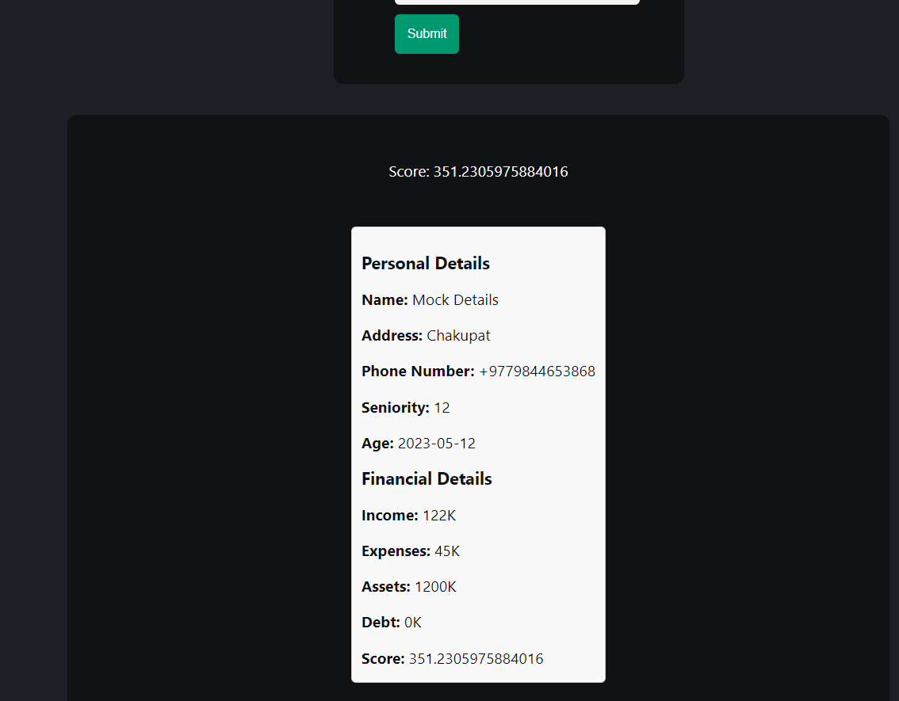
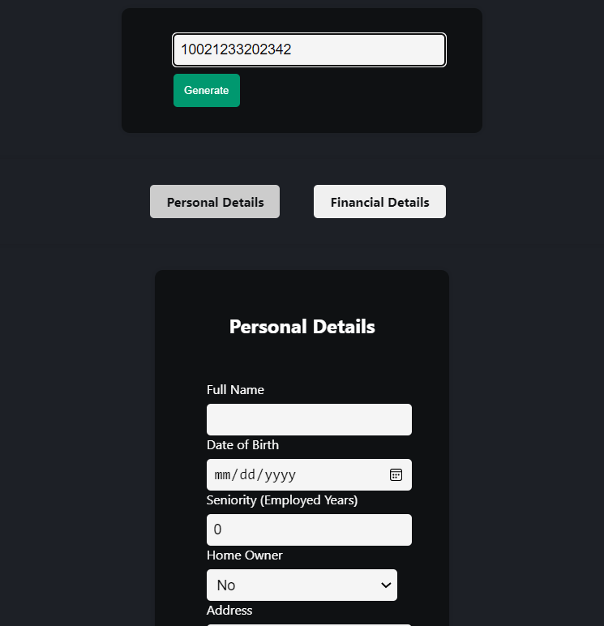

# Credit Score Calculation & Analysis

Web application that calculates credit scores and generates a report.


## Features

- Easy to use web application UI
- Perform Credit score calculation and reporting
- Search for the score and reports


## Tech Stack

**Client:** React, VanillaCSS

**Server:** Flask

**Database:** SQLAlchemy


##  Structure

Overall project structure

    .
    ├── frontend     
    |   ├──public/
    |   ├──package.json  #Contains modules to be installed
    |   └──src/          #Our main code lies here
    |       ├── index.js    #no need to touch this
    |       ├── index.css   #no need to touch this
    |       ├── App.css 
    |       └── App.js      #code here for all UI
    ├── backend      
    |   ├── main.py      #Starting point of backend
    |   ├── requirements.txt #All the modules to be installed
    |   └── app/
    |       ├── __init__.py #Initialization of flask app
    |       ├── routes.py   #Routes for apis (api reference below)
    |       ├── database.db   #database 
    |       └── models.py   # database model schema
    |       └── analyse.py   # main functionality for analysis
    └── README.md
## Installation

Clone the project

```bash
  git clone https://github.com/aagatpokhrel/credit-score-analysis.git
```

Go to the project directory

```bash
  cd credit-score-analysis
```

For backend dependencies

```bash
  cd backend
  pip install -r requirements.txt
```

For frontend dependencies
```bash
  cd frontend
  npm install
```

    
## How to Use

For running backend
```bash
cd backend
python main.py
```

For running frontend
```bash
cd frontend
npm start
```

Then in the frontend you fill all the details required, including personal as well as financial details.


And then submit the form to get the results as



Similarly search can also be performed on the previously stored data through SSNs




## API Reference

#### Test the backend

```http
  GET /
```

#### Search for the stored details 

```http
  GET /search/?query={searchQuery}
```

the search query is SSN number

#### Credit-Score

```http
  POST /credit-score
```

| Parameter           | Type     | Description                                     |
| :------------------ | :------- | :---------------------------------------------- |
| `social_security_number`  | `string` | Social Security Number of the user              |
| `name`              | `string` | Full name of the user                           |
| `address`           | `string` | Address of the user                             |
| `phone_number`      | `string` | Phone number of the user                        |
| `seniority`         | `number` | Seniority of the user (years in employment)                    |
| `home`              | `boolean`| Home ownership status of the user                |
| `age`               | `string` | Date of birth of the user                        |
| `marital`           | `string` | Marital status of the user                       |
| `expenses`          | `number` | Monthly expenses of the user (in K)                     |
| `income`            | `number` | Monthly income of the user(in K)                   |
| `assets`            | `number` | Total assets of the user(in K)                       |
| `debt`              | `number` | Total debt of the user(in K)                    |
| `time`              | `number` | no of times loan taken            |
| `times_paid_on_time`| `number` | Number of times paid on time                     |
| `avg_overdue_time`  | `number` | Average overdue time for payments (days)         |


## Implementation Details


#### Tasks

- Research and select appropriate credit bureau APIs that provide credit scoring data and documentation on their usage.
- Implement backend functionality to consume the credit bureau APIs, handle user data submissions, and calculate credit scores based on predefined algorithms.
- Design a user-friendly interface for users to input their financial and personal data, view their credit scores, and generate detailed credit reports.
- Consider privacy and security measures to protect user data and ensure compliance with data protection regulations.

#### Task 1

- Thorough research was conducted and i found that credit bureau APIs(Equifax, TransUnion, Experian) cost money and are available within region.
- So to replace the APIs to get the credit scoring data, what i have done is replaced that with data from the csv file.
- The data contains relevant information of credit reports downloaded from a source.

#### Task 2

- Backend was implemented with Flask, a database SQLAlchemy was created to store the data. Different routes such as /search and /credit-score was made.
- /credit-score handle the user form submission and the regression model evaluates the score for the data.
- The FICO score was already present in the database. Because it is a proprietary algorithm, we can only predict the FICO score for new data based on the existing datasets. 
- Therefore it might not be quite exact. The algorithm used for the prediction was regression algorithm.

#### Task 3

- The user interface and frontend was created using ReactJS and CSS. 
- The UI contains forms to input personal as well as financial data. 
- Once the submission is done, the data is sent to the backend, and output response i.e, score and report is received. 
- The output response is then displayed to the user in the same page.

#### Task 4
- `social_security_number` is a valuable information piece that shouldn't be made public. Therefore we have to encrypt the ssn before sending from the frontend to the backend. 
- For this we use `SHA256` algorithm as our security mechanism to hash the ssn. 
- Hashing is a one way encryption, that means it cannot be decrypted, however if we want to search for the SSN information, what our frontend does is, hash the search query again and compare to the hashed ssns stored in the database to find out what ssn matches and returns the results. 